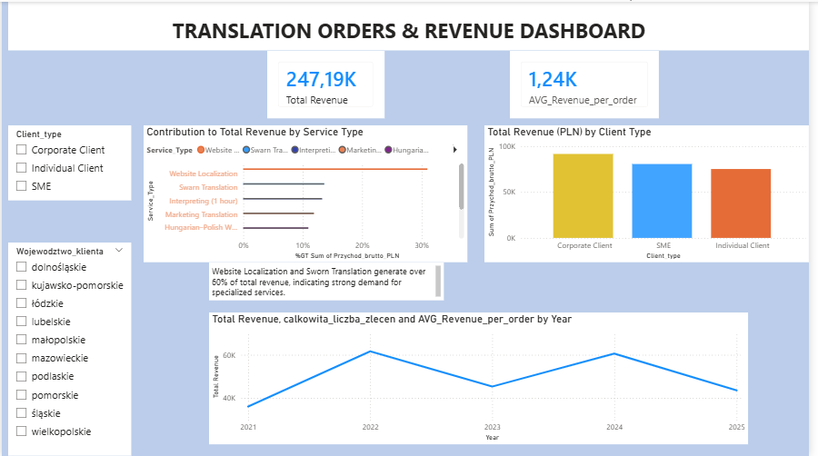
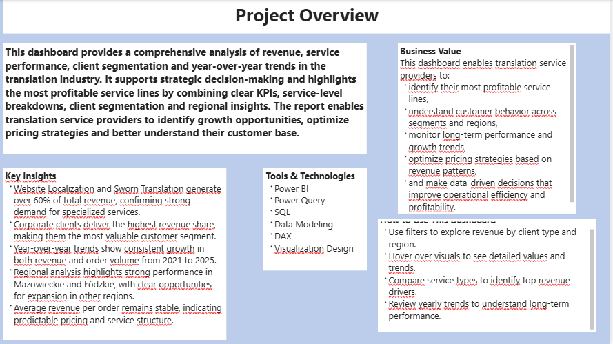

# Analiza sprzedażowa fikcyjnego Biura tłumaczeń
versja: 1.1.0.
Dostępne języki: English | [Polish]

Projekt pokazuje jak przy pomocy narzędzi takich jak SQL i Power BI oraz Power Query przeprowadziłem analizę kondycji fikcyjnego biura tłumaczeń. 

Źródło danych: Dane wygenerowane przez czat GPT

## Podsumowanie 

Analiza dotyczy zachowania klientów, kondycji finansowej jak i rentowności sprzedawanych produktów / usług. 

## Kontekst biznesowy / Pytania do projektu

1. Które miesiące są najmocniejsze, a które najsłabsze? (Czy istnieje sezonowość)
2. Jak wyglada marża brutto / netto? (czy zarabiamy proporcjonalnie do przychodów, czy koszty rosną  szybciej niż przychody?)
3. Które rodzaje usług generują największy przychód? 
Jak zmienia  się udział usług w czasie? (czy rośnie popyt na tłumaczenia specjalistyczne, czy spada zapotrzebowanie na tłumaczenia zwykłe?)
4. Który rodzaj klientów generuje największy przychód?
5. jak wygląda rozłożenie geograficzne sprzedaży?
6. Jaka jest średnia ilość zleceń w miesiącu?

## Wykorzystane narzędzia 

Narzędzia: Power Query, SQL, Power BI

##  Podgląd raportu

Poniżej znajdują się dwa główne zrzuty ekranu prezentujące projekt:

### 1. Dashboard – widok główny

### 2. Opis projektu w raporcie

## Historia rozwoju projektu 

| Wersja | Data | Opis  zmian
| :----- | :--- | :---|
| v.1.1.1 | 15.03.2026 | Implementacja dashboardu Power BI 
| v.1.1.0 | 23.02.2026 | Pełna refaktoryzacja. Poprawa logiki marży, optymalizacja zapytań SQL oraz poprawa warstwy wizualnej i dokumentacji. |
|v.1.0.0 | 21.10.2025 | Wersja pierwotna (Wstępny szkic analizy) |  

